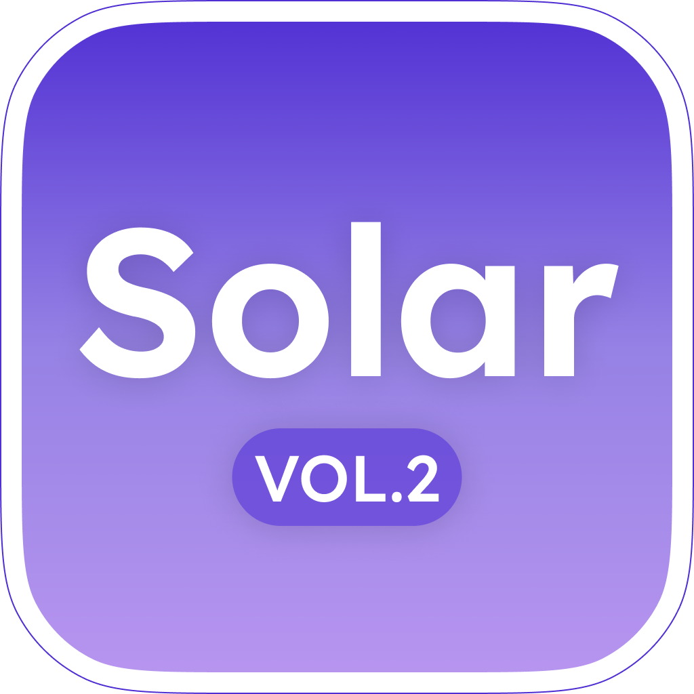
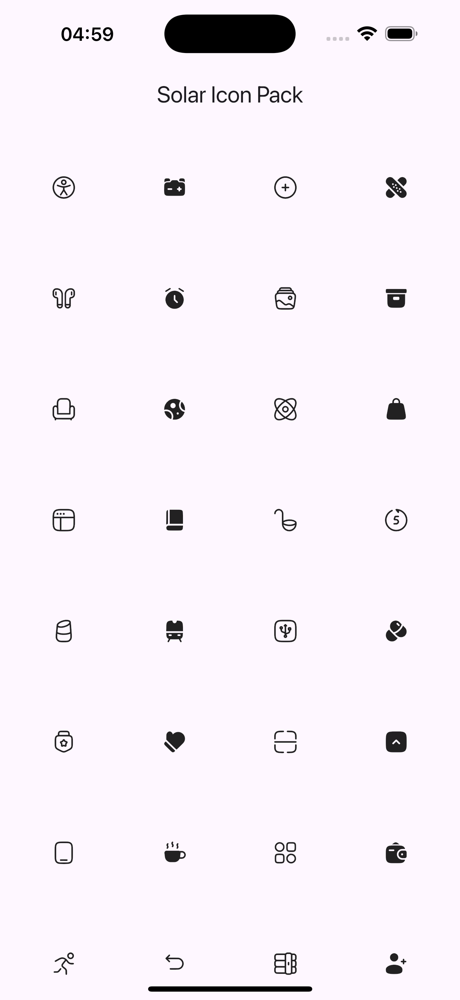

# solar community icons

Flutter package providing Solar community icons in a reusable Flutter-friendly API.
Built from the [Solar Icons Set (Vol.2)](https://www.figma.com/design/DrZlZ8tqipdT50bDYOF2iR/Solar-Icons-Set--Vol.2---Community-?node-id=1-3&p=f&t=mmTR1lGiSr0mAt4M-0).

Big thanks to [480 Design](https://www.figma.com/@480design) and [R4IN80W](https://www.figma.com/@voidrainbow), the creators of this icon set.

## Features

* 1,258 bold icons
* 1,254 linear icons

## Usage

```dart
import 'package:flutter/material.dart';
import 'package:solar_community_icons/solar_community_icons.dart';

class IconWidget extends StatelessWidget {
  const IconWidget();

  @override
  Widget build(BuildContext context) {
    return Card(
      child: Column(
        mainAxisAlignment: MainAxisAlignment.center,
        children: [
          Icon(SolarLinearIcons.bell),
          const SizedBox(height: 8),
          Text('Linear Bell Icon'),
        ],
      ),
    );
  }
}
```

## Screenshots



## Credits

* Zinon Software
* Solar Icons Set (Vol.2) community artwork
